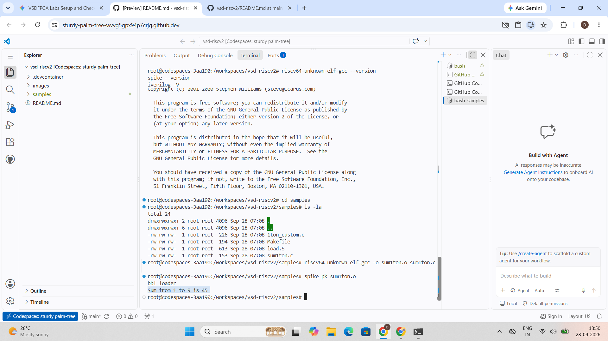
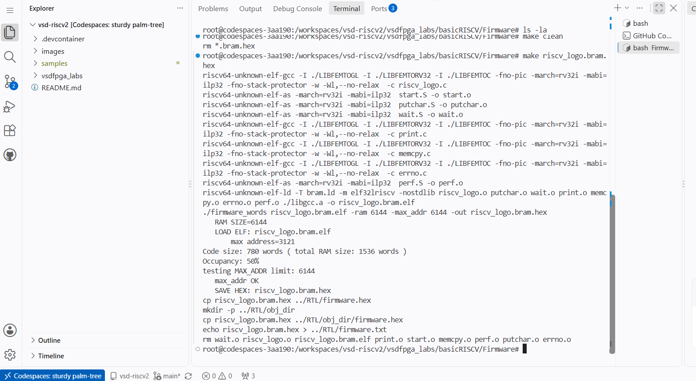
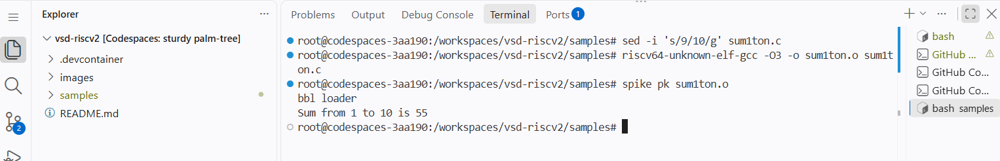

# Task 1: Environment Setup & RISC-V Reference Bring-Up

* **Environment Confirmation:** GitHub Codespaces only (Reference container: `vsdip/vsd-riscv2`)

---

## 1. Execution Evidence & Verification

### A. RISC-V Reference Program Execution
The reference C application (`sum1ton.c`) was compiled with the `riscv64-unknown-elf-gcc` cross-compiler and simulated using the Spike ISA simulator coupled with the RISC-V Proxy Kernel (`pk`).

### B. VSDFPGA Lab Bring-Up
The `vsdfpga_labs` repository was integrated into the workspace. The reference firmware (`riscv_logo.c`) was built using the embedded bare-metal toolchain (`-march=rv32i -mabi=ilp32`), generating the target execution ELF and block RAM image (`riscv_logo.bram.hex`).

### C. Optional Confidence Task (Program Modification)
The loop bound in `sum1ton.c` was adjusted from `n = 9` to `n = 10`. The source was recompiled and simulated via Spike, confirming the expected output `Sum from 1 to 10 is 55`.

---

## 2. Understanding Check Answers

### Q1: Where is the RISC-V program located in the vsd-riscv2 repository?
**Answer:**  
In the `vsd-riscv2` repository, the sample C programs (such as `sum1ton.c`) are located inside the `samples/` folder. In the `vsdfpga_labs` repository, the RISC-V firmware source code (such as `riscv_logo.c`) is located in the `basicRISCV/Firmware/` folder.

### Q2: How is the program compiled and loaded into memory?
**Answer:**  
* **Compilation:** We use the RISC-V cross-compiler (`riscv64-unknown-elf-gcc`) to translate human-readable C code into RISC-V machine instructions, producing an ELF binary executable.
* **Loading into Memory:** 
  * In the Spike ISA simulator, the Proxy Kernel (`pk`) reads the ELF binary and loads the program instructions directly into the simulated memory space.
  * In FPGA/Verilog simulation, the ELF executable is converted into a hexadecimal text file (`riscv_logo.bram.hex`), which is loaded directly into the FPGA's on-chip Block RAM (BRAM) using the `$readmemh` directive.

### Q3: How does the RISC-V core access memory and memory-mapped IO?
**Answer:**  
The processor uses standard assembly load and store instructions (`lw` to read data, `sw` to write data) for both memory and peripherals. The system uses a shared address map: an address decoder checks the address being accessed. If the address points to RAM, it reads/writes memory; if it falls within a peripheral's address range (like UART or GPIO), it talks directly to that peripheral's registers.

### Q4: Where would a new FPGA IP block logically integrate in this system?
**Answer:**  
A new FPGA IP block is connected to the system bus (such as Wishbone or AXI) as a peripheral slave. It is assigned a specific address range in the system memory map so the RISC-V CPU can control it and exchange data simply by reading and writing to those designated addresses.
