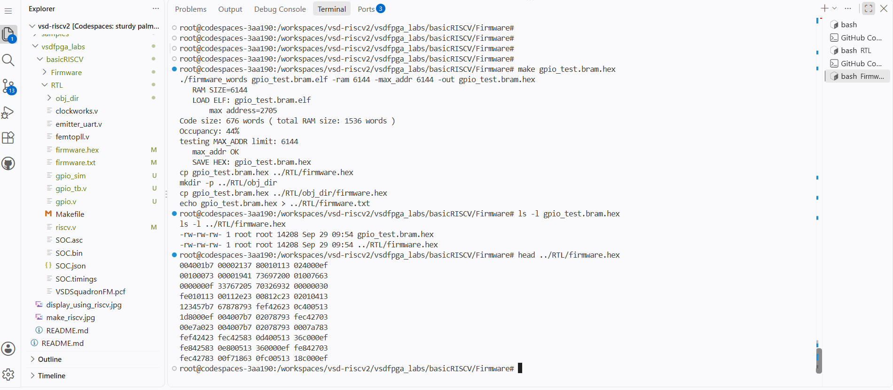

# Task-2: Design & Integrate a Memory-Mapped GPIO IP

## Objective

The objective of this task was to design a simple 32-bit GPIO IP, integrate it with the existing RISC-V SoC using memory-mapped I/O, and verify its operation through simulation.

## 1. GPIO IP Design

A simple 32-bit GPIO IP was designed with:

- 32-bit GPIO register
- Write operation from the CPU
- Readback of the stored value
- GPIO output reflecting the stored register value
- Synchronous register update

RTL file:

`RTL/gpio.v`

## 2. Memory-Mapped Integration

The GPIO IP was connected to the existing RISC-V SoC memory-mapped I/O interface.

The existing peripheral decoding uses address bits as follows:

| Address Bit | Peripheral |
|-------------|------------|
| Bit 0 | LED |
| Bit 1 | UART Data |
| Bit 2 | UART Status |
| Bit 3 | GPIO |

The GPIO register is therefore accessed using the GPIO offset:

`0x20`

The current implementation uses:

`0x00400020`

for the GPIO register.

## 3. Standalone Verification

Before integrating the GPIO with the CPU, the GPIO module was tested independently using a Verilog testbench.

Testbench:

`RTL/gpio_tb.v`

Test value:

`0x12345678`

Simulation result:

    GPIO OUT  = 12345678
    GPIO READ = 12345678
    GPIO TEST PASSED

This confirms that the GPIO register correctly stores the written value and provides the same value for output and readback.

## 4. Firmware

A C firmware program was created to test CPU access to the GPIO register.

Firmware:

`Firmware/gpio_test.c`

The firmware:

1. Writes `0x12345678` to the GPIO register.
2. Reads the value back.
3. Compares the read value with the written value.
4. Reports whether the test passed or failed through UART.

The firmware was compiled and converted into the required `firmware.hex` format for simulation.

## 5. CPU + GPIO SoC Verification

A CPU-level testbench was created to verify the complete memory-mapped GPIO path.

Testbench:

`RTL/gpio_soc_tb.v`

The simulation verified that the RISC-V CPU can access the GPIO using its memory-mapped address.

Simulation result:

    GPIO WRITE: addr=00400020 data=12345678
    GPIO OUTPUT VERIFIED: 12345678
    GPIO CPU TEST PASSED

## 6. Data Flow

    Firmware
       ↓
    RISC-V CPU
       ↓
    Memory-Mapped I/O
       ↓
    Address Decoder
       ↓
    GPIO IP
       ↓
    GPIO Register
       ↓
    GPIO Output

