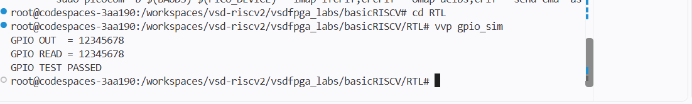

# Task-2: Memory-Mapped GPIO IP

## Objective

Designed a simple 32-bit GPIO IP, integrated it with the existing RISC-V SoC using memory-mapped I/O, and verified it through simulation.

---

## 1. GPIO IP

Created the GPIO module in:

```text
RTL/gpio.v
```

The IP contains a 32-bit register. A CPU write stores the value, which is available on `gpio_out` and can also be read back.

```verilog
always @(posedge clk) begin
    if (gpio_write)
        gpio_reg <= gpio_wdata;
end

assign gpio_out  = gpio_reg;
assign gpio_rdata = gpio_reg;
```

---

## 2. Standalone GPIO Test

Before SoC integration, the GPIO was tested using:

```text
RTL/gpio_tb.v
```

Test value:

```text
0x12345678
```

Result:

```text
GPIO OUT  = 12345678
GPIO READ = 12345678
GPIO TEST PASSED
```



---

## 3. RISC-V Integration

The GPIO was integrated into `riscv.v`.

GPIO decoder bit:

```verilog
localparam IO_GPIO_bit = 3;
```

Peripheral mapping:

```text
bit 0 → LED
bit 1 → UART data
bit 2 → UART status
bit 3 → GPIO
```
