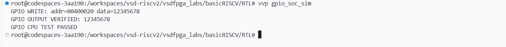

# Task-2: Design & Integrate a Memory-Mapped GPIO IP

## Objective

The objective of this task was to design a simple 32-bit GPIO IP, integrate it with the existing RISC-V SoC using memory-mapped I/O, and verify its operation through simulation.

# Task-2: Design & Integrate a Memory-Mapped GPIO IP

## 1. GPIO IP RTL

A simple 32-bit memory-mapped GPIO IP was designed in Verilog.

**RTL file:** `RTL/gpio.v`

The GPIO contains a 32-bit register that:

- Stores the value written by the CPU
- Drives the stored value on `gpio_out`
- Returns the stored value when the CPU reads the GPIO register

---

## 2. SoC Integration

The GPIO was integrated into the existing RISC-V SoC through the existing memory-mapped I/O interface.

The peripheral address decoding uses:

| Address Bit | Peripheral |
|---|---|
| Bit 0 | LED |
| Bit 1 | UART Data |
| Bit 2 | UART Status |
| Bit 3 | GPIO |

For GPIO, address bit 3 is decoded to generate the GPIO write-enable signal.

The GPIO read data is also connected to the SoC's I/O read-data multiplexer.

**Integration file:** `RTL/gpio_soc_tb.v`  
**GPIO RTL:** `RTL/gpio.v`

---

## 3. Address Used

The existing SoC uses:

`IO_BASE = 0x00400000`

GPIO is mapped to offset:

`0x20`

Therefore, the GPIO register address used in this implementation is:

`0x00400020`

---

## 4. How the CPU Accesses the GPIO

The CPU accesses the GPIO as a memory-mapped peripheral.

### Write

The CPU places:

- GPIO address on `mem_addr`
- Data on `mem_wdata`
- Write enable on `mem_wmask`

The SoC address decoder detects the GPIO address and generates the GPIO write signal.

The GPIO register then stores the value.

### Read

For a GPIO read, the CPU provides the GPIO address and asserts the read request.

The stored GPIO register value is connected to the SoC's `mem_rdata` path, allowing the CPU to read the previously written value.

---

## 5. Simulation Validation

The GPIO was first tested independently using:

`RTL/gpio_tb.v`

Test value:

`0x12345678`

Simulation result:

    GPIO OUT  = 12345678
    GPIO READ = 12345678
    GPIO TEST PASSED

The integrated CPU + GPIO path was then tested using:

`RTL/gpio_soc_tb.v`

Simulation result:

    GPIO WRITE: addr=00400020 data=12345678
    GPIO OUTPUT VERIFIED: 12345678
    GPIO CPU TEST PASSED

---

