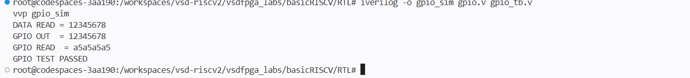
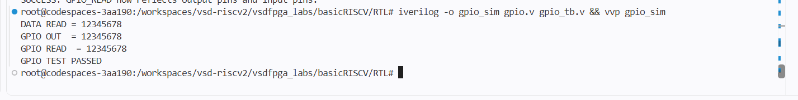
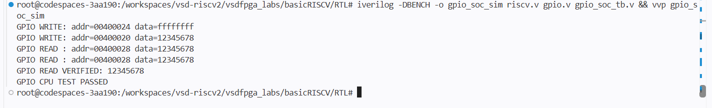
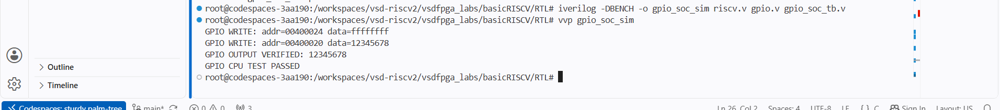

# Task-3: Design a Multi-Register GPIO IP with Software Control

## Objective

Design and validate a memory-mapped GPIO IP with multiple software-accessible registers for GPIO data, direction control, and pin readback.

The GPIO IP supports 32 GPIO pins.

## GPIO Register Map

| Offset | Register | Access | Description |
|---|---|---|---|
| `0x00` | `GPIO_DATA` | R/W | Stores GPIO output data |
| `0x04` | `GPIO_DIR` | R/W | Controls GPIO pin direction |
| `0x08` | `GPIO_READ` | R | Reads current GPIO pin state |

### GPIO_DATA — 0x00

Stores the value to be driven on GPIO output pins.

- Write → Updates GPIO data.
- Read → Returns the stored GPIO data.

### GPIO_DIR — 0x04

Controls the direction of each GPIO pin independently.

- `1` → Output
- `0` → Input

For example:

```text
GPIO_DIR = 0xFFFFFFFF
```


## Simulation Evidence / Screenshots

The following screenshots provide evidence of the GPIO IP validation and CPU/SoC integration.

### 1. GPIO Register Test

Shows the GPIO register-level test and successful register operation.



### 2. GPIO Standalone Simulation

Shows the standalone GPIO simulation with:

- `DATA READ = 12345678`
- `GPIO OUT = 12345678`
- `GPIO READ = 12345678`
- `GPIO TEST PASSED`



### 3. CPU GPIO Read Validation

Shows CPU/SoC memory-mapped GPIO read validation.



### 4. CPU GPIO Test Passed

Shows the complete CPU/SoC GPIO validation with successful GPIO readback.


